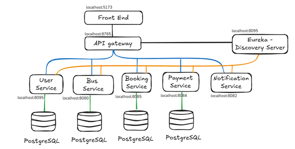
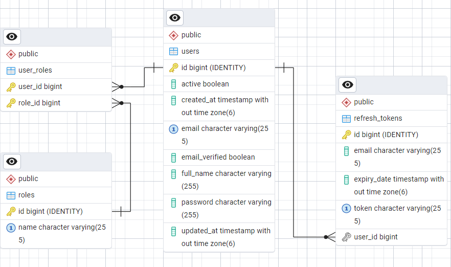
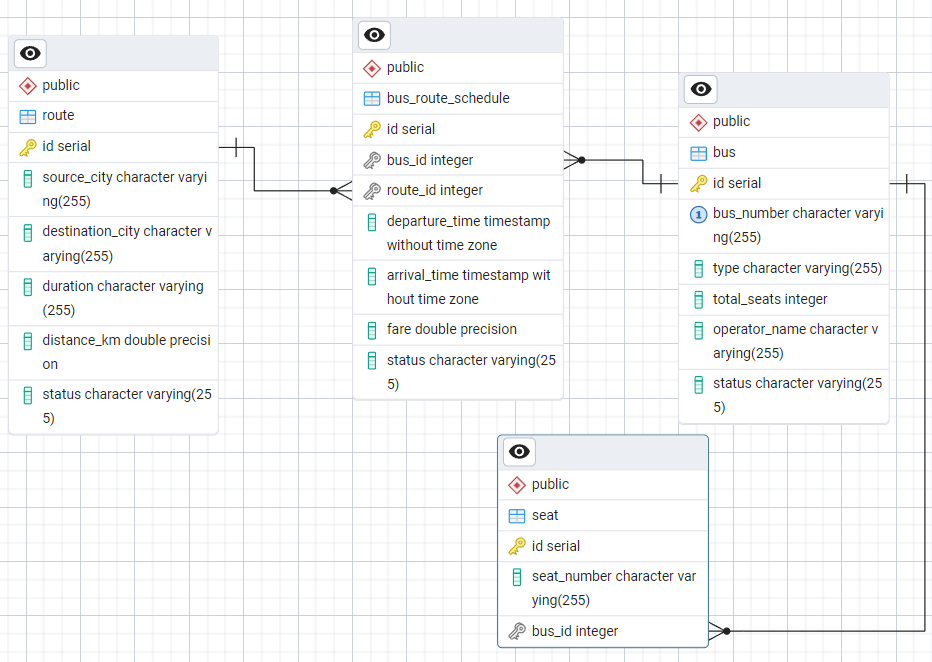
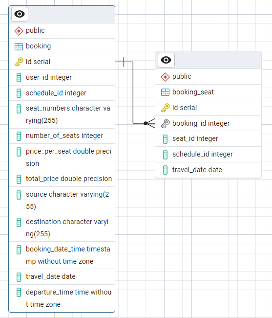
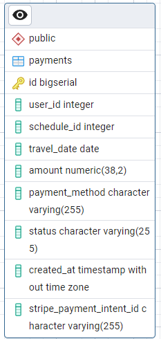
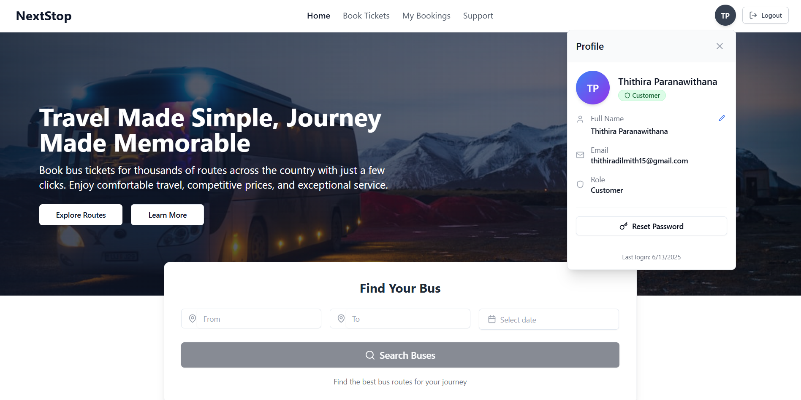

# NextStop - Microservices-based Bus Ticket Reservation System

<div align="center">
  
  
  ### 🚌 *Bus Ticket Reservation System*
  
  [](https://spring.io/projects/spring-boot)
  [](https://reactjs.org/)
  [](https://www.postgresql.org/)
  [](https://www.oracle.com/java/)
  
  ---
  
  **A scalable, secure, and user-friendly bus reservation platform**
  
</div>

---

## 📋 Table of Contents

- [🚀 Overview](#-overview)
- [🌟 Key Highlights](#-key-highlights)
- [✨ Features](#-features)
- [🛠️ Technology Stack](#️-technology-stack)
- [🏗️ System Architecture](#️-system-architecture)
- [🗄️ Database Design](#️-database-design)
- [🚀 Getting Started](#-getting-started)
- [📸 Screenshots](#-screenshots)
- [🧪 Testing](#-testing)
- [🤝 Contributing](#-contributing)
- [👥 Team](#-team)
- [🙏 Acknowledgments](#-acknowledgments)

---

## 🚀 Overview

**NextStop** is a modern, distributed microservices-based bus ticket reservation system that streamlines the entire booking process from seat selection to payment confirmation. Built with Spring Boot microservices architecture and a responsive React.js frontend, it provides a seamless experience for passengers while offering robust management capabilities for bus operators.

---

## 🌟 Key Highlights

<div align="center">

| Feature | Description |
|---------|-------------|
| 🏗️ **Microservices Architecture** | Scalable and maintainable distributed system |
| ⚡ **Real-time Operations** | Live seat availability and instant booking confirmations |
| 🔐 **Secure Payments** | Integrated Stripe payment gateway with test environment |
| 📱 **User-Friendly Interface** | Responsive design across all devices |
| 📧 **Email Notifications** | Automated booking confirmations and verification emails |

</div>

---

## ✨ Features

### 👥 For Passengers

<table>
<tr>
<td width="50%">

#### 🔐 **Authentication & Security**
- Secure registration and login with JWT tokens
- Email verification system
- Password reset functionality

#### 🔍 **Smart Booking**
- Search buses by route, date, and time
- Interactive seat map with real-time availability
- Advanced filtering options

</td>
<td width="50%">

#### 💳 **Payment & Tickets**
- Stripe integration with multiple payment options
- Secure payment processing
- Digital tickets in PDF format

#### 📱 **User Experience**
- Responsive design across all devices
- Booking history and management
- Email notifications for confirmations

</td>
</tr>
</table>

### 👨‍💼 For Administrators

<table>
<tr>
<td width="50%">

#### 🚌 **Fleet Management**
- Add, edit, and manage bus information
- Configure routes and schedules
- Seat configuration management

</td>
<td width="50%">

#### 📊 **Analytics & Control**
- Real-time dashboard with analytics
- User account management
- Comprehensive booking oversight

</td>
</tr>
</table>

---

## 🛠️ Technology Stack

### 🔧 Backend Technologies

<div align="center">

| Technology | Version | Purpose |
|------------|---------|---------|
| ☕ **Spring Boot** | 3.5 | Application Framework |
| 🟨 **Java** | 21 | Programming Language |
| ☁️ **Spring Cloud** | 2025.0.0 | Microservices Architecture |
| 🔍 **Netflix Eureka** | Latest | Service Discovery |
| 🚪 **Spring Cloud Gateway** | Latest | API Gateway |
| 🐘 **PostgreSQL** | 17 | Database |
| 🔑 **JWT** | Latest | Authentication |
| 💳 **Stripe API** | Latest | Payment Processing |
| 📧 **Spring Mail** | Latest | Email Service |

</div>

### 🎨 Frontend Technologies

<div align="center">

| Technology | Version | Purpose |
|------------|---------|---------|
| ⚛️ **React.js** | 18 | Frontend Framework |
| 📘 **TypeScript** | Latest | Programming Language |
| 🎨 **Tailwind CSS** | Latest | Styling Framework |
| 🪝 **React Hooks** | Latest | State Management |
| 🌐 **Axios** | Latest | HTTP Client |
| 📄 **jsPDF** | Latest | PDF Generation |

</div>

### 🏗️ Infrastructure

<div align="center">

| Component | Purpose |
|-----------|---------|
| 🔍 **Netflix Eureka Server** | Service Registry |
| 🚪 **Spring Cloud Gateway** | Load Balancing |
| 🐳 **Docker** | Containerization |
| 📮 **Postman** | API Testing |
| 🔄 **Git** | Version Control |

</div>

---

## 🏗️ System Architecture

<div align="center">
  
  
  ### *Microservices Architecture Overview*
</div>

The NextStop system follows a **microservices architecture pattern** with the following components:

### 🎯 Core Services

<div align="center">

| Service | Port | Responsibility |
|---------|------|---------------|
| 👤 **User Service** | 8095 | User authentication, registration, and profile management |
| 🚌 **Bus Service** | 8090 | Bus information, routes, and schedules management |
| 🎫 **Booking Service** | 8765 | Seat bookings and availability processing |
| 💳 **Payment Service** | 8080 | Payment processing with Stripe integration |
| 📧 **Notification Service** | 8082 | Email notifications management |

</div>

### 🌐 Infrastructure Components

<div align="center">

| Component | Port | Function |
|-----------|------|----------|
| 🔍 **Eureka Server** | 8761 | Service discovery and registration |
| 🚪 **API Gateway** | 8765 | Centralized routing and load balancing |
| 🎨 **Frontend Application** | 5173 | React.js user interface |

</div>

---

## 🗄️ Database Design

### 👤 User Database (PostgreSQL)

<div align="center">
  
  
  **User Management & Authentication**
</div>

**Tables:**
- 👥 `users` - User account information
- 🔐 `roles` - User roles (CUSTOMER, ADMIN, OPERATOR)
- 🔗 `user_roles` - User-role mapping
- 🔄 `refresh_tokens` - JWT refresh tokens
- ✅ `verification_tokens` - Email verification tokens

### 🚌 Bus Database (PostgreSQL)

<div align="center">
  
  
  **Fleet & Route Management**
</div>

**Tables:**
- 🚌 `buses` - Bus information and specifications
- 🛣️ `routes` - Bus routes between cities
- 📅 `schedules` - Bus schedule information
- 💺 `seats` - Seat configuration for each bus

### 🎫 Booking Database (PostgreSQL)

<div align="center">
  
  
  **Reservation Management**
</div>

**Tables:**
- 📋 `bookings` - Booking records and details
- 💺 `booking_seats` - Seat reservations for bookings

### 💳 Payment Database (PostgreSQL)

<div align="center">
  
  
  **Payment Processing**
</div>

**Tables:**
- 💰 `payments` - Payment transaction records
- 💳 `payment_methods` - Supported payment methods

---

## 🚀 Getting Started

### 📋 Prerequisites

<div align="center">

| Requirement | Version | Download |
|-------------|---------|----------|
| ☕ **Java** | 21+ | [Download Java](https://adoptium.net/) |
| 🟢 **Node.js** | 18+ | [Download Node.js](https://nodejs.org/) |
| 🐘 **PostgreSQL** | 15+ | [Download PostgreSQL](https://www.postgresql.org/) |
| 🐳 **Docker** | Latest (Optional) | [Download Docker](https://www.docker.com/) |
| 📂 **Git** | Latest | [Download Git](https://git-scm.com/) |

</div>

### 🔧 Installation

#### **1. Clone the Repository**

```bash
git clone https://github.com/Thithira-Paranawithana/NextStop-AllFiles.git
cd nextstop-bus-reservation
```

#### **2. Setup Databases**

```bash
# Create databases
createdb userdb
createdb busdb
createdb bookingdb
createdb paymentdb

# Import database scripts
psql -d userdb -f NextStop-DB/userdb.sql
psql -d busdb -f NextStop-DB/busdb.sql
psql -d bookingdb -f NextStop-DB/bookingdb.sql
psql -d paymentdb -f NextStop-DB/paymentdb.sql
```

#### **3. Configure Environment Variables**

```properties
# Update application.properties for each service
spring.datasource.url=jdbc:postgresql://localhost:5432/userdb
spring.datasource.username=your_username
spring.datasource.password=your_password
```

#### **4. Start Services (in order)**

```bash
# 1. Start Eureka Server
cd eureka-server
./mvnw spring-boot:run

# 2. Start API Gateway
cd ../api-gateway
./mvnw spring-boot:run

# 3. Start Microservices
cd ../user-service
./mvnw spring-boot:run

cd ../bus-service
./mvnw spring-boot:run

cd ../booking-service
./mvnw spring-boot:run

cd ../payment-service
./mvnw spring-boot:run

cd ../notification-service
./mvnw spring-boot:run
```

#### **5. Start Frontend**

```bash
cd frontend
npm install
npm run dev
```

#### **6. Access the Application**

<div align="center">

| Service | URL | Description |
|---------|-----|-------------|
| 🌐 **Frontend** | http://localhost:5173 | Main Application |
| 📊 **Eureka Dashboard** | http://localhost:8761 | Service Registry |
| 🚪 **API Gateway** | http://localhost:8765 | API Gateway |

</div>

---

## 📸 Screenshots

### 🏠 Landing Page

<div align="center">
  
  
  **Modern and Intuitive User Interface**
</div>

---

## 🧪 Testing

### 📮 API Testing with Postman

```bash
# Import Postman collection
postman-collection/NextStop-API-Tests.json
```

### 🔍 Running Tests

```bash
# Backend tests
./mvnw test

# Frontend tests
npm test
```

---

## 🤝 Contributing

We welcome contributions! Please follow these steps:

1. 🍴 **Fork** the repository
2. 🌿 **Create** a feature branch (`git checkout -b feature/AmazingFeature`)
3. 💾 **Commit** your changes (`git commit -m 'Add some AmazingFeature'`)
4. 📤 **Push** to the branch (`git push origin feature/AmazingFeature`)
5. 🔄 **Open** a Pull Request

---

## 👥 Team

<div align="center">

### 🌟 **Development Team**

<table>
<tr>
<td align="center">
<b>Thithira Paranawithana</b><br />
</td>
<td align="center">
<b>Dilranga Dissanayake</b><br />
</td>
<td align="center">
<b>Nipuni Tennakoon</b><br />
</td>
</tr>
</table>

</div>

---

## 🙏 Acknowledgments

<div align="center">

### 🎯 **Special Thanks**

| Technology | Contribution |
|------------|-------------|
| 🍃 **Spring Boot Team** | Excellent microservices framework |
| ⚛️ **React.js Community** | Powerful frontend library |
| 💳 **Stripe** | Seamless payment integration |
| 🐘 **PostgreSQL** | Robust database system |

</div>

---

<div align="center">

### 🚌 **NextStop - Connecting Journeys, One Click at a Time**

---

<h3>Made with ❤️ by the NextStop Team</h3>

**© 2025 NextStop. All rights reserved.**

</div>